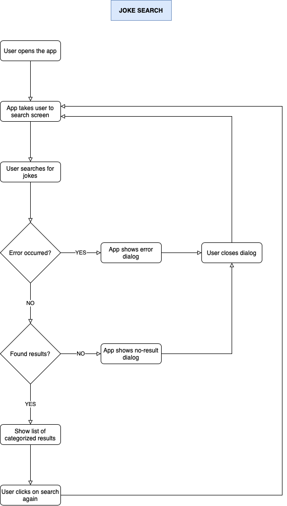

# STONE ANDROID CHALLENGE

Practical challenge completed as part of the recruiting process of Stone Pagamentos.

The app consists of a Chuck Norris' fact searcher that allows users to share facts with other apps.

# Base Flowchart

# Requirements  

On your computer:
Download and install both JDK 1.8 and Android Studio:

* Android Studio - https://developer.android.com/studio/
* JDK 1.8 (JDK 8) - https://www.oracle.com/java/technologies/javase-jdk8-downloads.html

In case you prefer to an emulator to run the app, download an ADV following these steps:
* https://developer.android.com/studio/run/managing-avds

On your smartphone:
* An Android device is enough.

# How to run it

On your computer:
* After installing the software mentioned above, open the project with Android Studio and run in either on your actual device or on an emulator.

On your smartphone:
* Download the apk provided by me and install it directly into your Android device. This only applies to e-mail contact.

# Resources used on this project:

* **Kotlin** - modern programming language for native Android development;
* **Clean Architecture** - software design principles that allow for SOLID layering of the app, making the app scalable, agile and robust;
* **Test-Driven Development** - technique that allows abstractions to be readily tested, as a way to ensure robust feature development, allowing failures to happen as soon as possible, so they can be fixed before detailed implementation;
* **MockK** - powerful unit test library for Kotlin, to ensure solid Test-Driven Development cycles;
* **MockWebServer** - network test library for simulating API responses, to ensure solid Test-Driven Development cycles;
* **Retrofit 2** - HTTP client API that makes it easier to make REST API data requests;
* **RxKotlin** - asynchronous and event-based reactive programming library;
* **Room Persistence** - SQLite abstraction for data persistence in-app, for data fetch even if the app is offline;
* **Stateful MVVM** - presentation design pattern that allows better UI state control, ensuring reactive UI events based on ViewModel data changes; 
* **Dagger2** - dependency injection framework that ensures static compile-time dependency injection, allowing injection errors to be caught before users ever have a chance to do so; 
* **ViewBinding** - feature that ensures null-safety on calling views from a given layout;
* **Ktlint** - linter to ensure Kotlin usage and codestyle consistency throughout the app;
* **GitFlow** - branching model workflow that allows better control over the integration and delivery of production and development code;
* **Rebase** - git feature that allows organizing a git history in such a way that a development story may be clearly told, over a confusing development history;
* **Karma commit pattern** - semantic commit message pattern, to allow for understandable development history; and
* **Git hooks** - commit and pre-push git hooks to ensure that the code obeys linter, commit patterns and test rules, before integrating it to the codebase.

# Author

* **Leehendry Pauletto**
